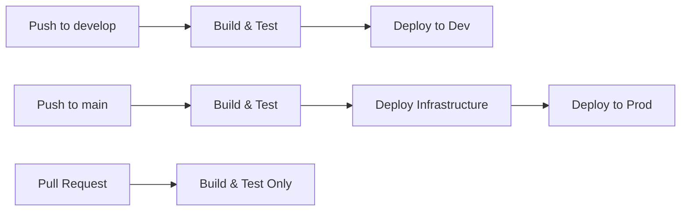

# GitHub Actions Deployment Setup Guide

This guide explains how to set up automated deployments to Azure using GitHub Actions.

## Prerequisites

- Azure resources deployed (completed ✅)
- GitHub repository with workflow file (`.github/workflows/backend-ci.yml`)
- Admin access to GitHub repository settings

---

## Required GitHub Secrets

You need to add the following secrets to your GitHub repository:

### 1. Azure Credentials (for Bicep deployments)

**Secret Name**: `AZURE_CREDENTIALS`

**How to get it**:
```powershell
# Create a service principal with Contributor role
az ad sp create-for-rbac --name "suled-github-actions" `
  --role contributor `
  --scopes /subscriptions/b2418834-5858-4ad0-a26b-fd8cc36e21ca/resourceGroups/suled-rg-dev `
  --sdk-auth
```

This will output JSON that looks like:
```json
{
  "clientId": "...",
  "clientSecret": "...",
  "subscriptionId": "...",
  "tenantId": "...",
  ...
}
```

Copy the entire JSON output and save it as `AZURE_CREDENTIALS` secret in GitHub.

---

### 2. Azure Subscription ID

**Secret Name**: `AZURE_SUBSCRIPTION_ID`  
**Value**: `b2418834-5858-4ad0-a26b-fd8cc36e21ca`

---

### 3. Azure Resource Group

**Secret Name**: `AZURE_RG`  
**Value**: `suled-rg-dev` (for dev environment)

---

### 4. Function App Publish Profile (Dev)

**Secret Name**: `AZURE_FUNCTIONAPP_PUBLISH_PROFILE_DEV`

**How to get it**:
```powershell
az functionapp deployment list-publishing-profiles `
  --name suled-app-func `
  --resource-group suled-rg-dev `
  --xml
```

Copy the entire XML output and save it as the secret.

**Alternative (Azure Portal)**:
1. Go to Azure Portal
2. Navigate to `suled-app-func`
3. Click "Get publish profile" in the Overview page
4. Open the downloaded file and copy all contents
5. Save as secret in GitHub

---

### 5. Function App Publish Profile (Prod) - Optional

**Secret Name**: `AZURE_FUNCTIONAPP_PUBLISH_PROFILE`

Same process as above, but for production function app (when you create it).

---

### 6. Codecov Token (Optional)

**Secret Name**: `CODECOV_TOKEN`  
**Required**: No (only if you want code coverage reports)

Get from: https://codecov.io after signing up

---

## How to Add Secrets to GitHub

1. Go to your GitHub repository
2. Click **Settings** → **Secrets and variables** → **Actions**
3. Click **New repository secret**
4. Add each secret with its name and value
5. Click **Add secret**

---

## Workflow Configuration Updates Needed

Update `.github/workflows/backend-ci.yml`:

### 1. Update Function App Name
```yaml
env:
  AZURE_FUNCTIONAPP_NAME: 'suled-app-func'  # Changed from 'suled-functions'
```

### 2. Fix artifact upload branch reference
```yaml
    - name: Upload artifact for deployment
      if: github.ref == 'refs/heads/main'  # Changed from master
```

### 3. Enable dev deployment
```yaml
  deploy-dev:
    runs-on: ubuntu-latest
    needs: build-and-test
    if: github.ref == 'refs/heads/develop'  # Changed from false
    environment:
      name: 'Development'
```

---

## Deployment Triggers

### Current Configuration

**Develop Branch** (`develop`):
- ✅ Runs tests on every push
- ✅ Deploys to `suled-app-func` (dev environment)
- ⚠️ Currently disabled - needs secrets to enable

**Main Branch** (`main`):
- ✅ Runs tests on every push
- ✅ Deploys infrastructure (Bicep)
- ✅ Deploys to production function app
- ⚠️ Currently disabled - needs secrets to enable

**Pull Requests**:
- ✅ Runs tests only
- ❌ Does not deploy

---

## Step-by-Step Setup

### Step 1: Create Service Principal
```powershell
az ad sp create-for-rbac --name "suled-github-actions" `
  --role contributor `
  --scopes /subscriptions/b2418834-5858-4ad0-a26b-fd8cc36e21ca/resourceGroups/suled-rg-dev `
  --sdk-auth
```

### Step 2: Get Publish Profile
```powershell
az functionapp deployment list-publishing-profiles `
  --name suled-app-func `
  --resource-group suled-rg-dev `
  --xml
```

### Step 3: Add Secrets to GitHub
Go to: `https://github.com/EvgenSk/suled-backend/settings/secrets/actions`

Add all required secrets listed above.

### Step 4: Update Workflow File
Make the necessary updates to `.github/workflows/backend-ci.yml` (see above).

### Step 5: Test Deployment
1. Create a feature branch
2. Make a small change (e.g., add a comment)
3. Commit and push to `develop`
4. Check GitHub Actions tab to see the workflow run

---

## Workflow Stages



### Build & Test (Always)
- Restore dependencies
- Build solution
- Run unit tests (67 tests)
- Run integration tests (6 blob storage tests)
- Generate code coverage report
- Create deployment artifact

### Deploy to Dev (develop branch)
- Download build artifact
- Deploy to `suled-app-func`
- Update function app

### Deploy to Prod (main branch)
- Deploy Bicep infrastructure updates
- Download build artifact
- Deploy to production function app

---

## Testing the Setup

### 1. Test on Feature Branch
```bash
git checkout -b test-deployment
echo "# Test" >> README.md
git add README.md
git commit -m "test: trigger CI/CD"
git push origin test-deployment
```

Check: Should run build & test only ✅

### 2. Test on Develop
```bash
git checkout develop
git merge test-deployment
git push origin develop
```

Check: Should deploy to dev environment ✅

### 3. Test on Main
```bash
git checkout main
git merge develop
git push origin main
```

Check: Should deploy infrastructure + production ✅

---

## Monitoring Deployments

### GitHub Actions Tab
- View all workflow runs
- See logs for each step
- Check deployment status

### Azure Portal
- Function App → Deployment Center
- View deployment history
- Check application logs

### Function App Logs
```powershell
func azure functionapp logstream suled-app-func
```

---

## Troubleshooting

### Authentication Failed
- Verify `AZURE_CREDENTIALS` secret is valid JSON
- Check service principal has correct permissions
- Ensure subscription ID is correct

### Deployment Failed
- Check publish profile is for correct function app
- Verify function app name matches in workflow
- Ensure .NET version matches (8.0)

### Tests Failed
- Integration tests may fail in CI (Cosmos DB emulator issue)
- Consider running only unit tests in CI
- Add `--filter "FullyQualifiedName~Tests&FullyQualifiedName!~IntegrationTests"` to test command

---

## Security Best Practices

✅ **Use Secrets** - Never commit credentials  
✅ **Service Principal** - Limit scope to specific resource group  
✅ **Publish Profiles** - Rotate regularly  
✅ **Branch Protection** - Require PR reviews for main  
✅ **Environment Secrets** - Use GitHub Environments for prod  

---

## Next Steps

1. ✅ Add all required secrets to GitHub
2. ✅ Update workflow file with correct values
3. ✅ Push changes to trigger first deployment
4. ✅ Set up branch protection rules
5. ✅ Configure deployment environments in GitHub
6. ✅ Add approval gates for production deployments
7. ✅ Set up deployment notifications (Slack/Teams)

---

## Useful Commands

### Get Function App URL
```powershell
az functionapp show --name suled-app-func --resource-group suled-rg-dev --query "defaultHostName" -o tsv
```

### List All Secrets Needed
```powershell
# This is a checklist - not a command
# - AZURE_CREDENTIALS
# - AZURE_SUBSCRIPTION_ID  
# - AZURE_RG
# - AZURE_FUNCTIONAPP_PUBLISH_PROFILE_DEV
# - AZURE_FUNCTIONAPP_PUBLISH_PROFILE (prod, optional)
# - CODECOV_TOKEN (optional)
```

### Manually Trigger Workflow
```bash
# Push to trigger
git push origin develop

# Or use GitHub CLI
gh workflow run backend-ci.yml
```

---

## Resources

- [Azure/functions-action](https://github.com/Azure/functions-action)
- [Azure/login](https://github.com/Azure/login)
- [Azure/arm-deploy](https://github.com/Azure/arm-deploy)
- [GitHub Actions Secrets](https://docs.github.com/en/actions/security-guides/encrypted-secrets)
